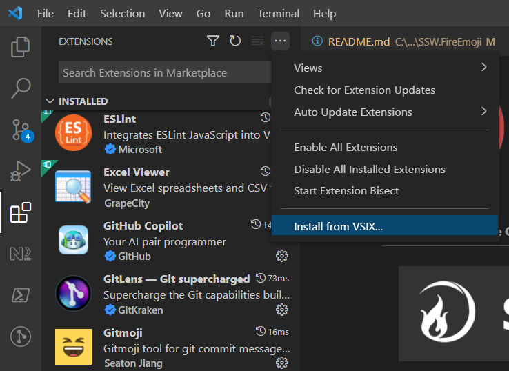

<!-- TODO: Add link to deployed site -->

 

---

 

This project was inspired by [GitMoji](https://github.com/carloscuesta/gitmoji) - a standard for use of emojis in commit messages.

# 🤷🏻‍♂️  Why?

At SSW, we love using GitMoji on our projects, but sometimes finding the right emoji is a challenge.

There are almost 70 different GitMojis, so sometimes its hard to pick the best one.

# 🥅  Our goal

Automate the selection of GitMojis using AI.

# :octocat: Install VS Code extension

In VS Code:

1. Go to Extensions
2. Under `...` click `Install from VSIX`
3. Select `releases/latest/vscode/ssw-fireemoji-vscode-preview.vsix`

# 🏛 Architecture
Currently, there are 3 parts to this project:
 - SSW.FireEmoji.Core
 - SSW.FireEmoji.WebApp - Blazor WASM PWA that implements SSW.FireEmoji.Core
 - SSW.FireEmoji.Trainer

# 👨🏻‍💻 F5 Experience

## Prerequisites
 - [Dotnet](https://dotnet.microsoft.com/download)

## Running the project

1. Clone the project
